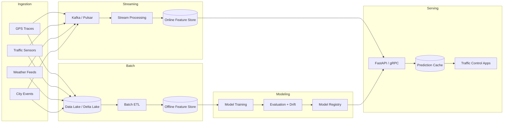

# Advanced Urban Traffic Congestion Forecasting System

## 1. System Architecture (End-to-End)



**Rationale**
- **Dual pipeline (batch + streaming)** enables high-quality retraining on historical data and low-latency inference for real-time operations.
- **Feature stores** keep consistent feature definitions across training and serving.
- **Model registry** ensures versioning, rollback, and auditability.
- **Kafka/Pulsar** adds backpressure handling, replay, and horizontal scalability.

**Scalability & Fault Tolerance**
- Data lake with ACID storage (Delta/Iceberg) for reproducibility.
- Stream processors use exactly-once semantics and checkpointing.
- Stateless inference pods behind load balancers with autoscaling.

## 2. Data Sources & Data Generation

### Raw Data Schemas
- **GPS traces**: `timestamp`, `vehicle_id`, `zone_id`, `lat`, `lon`, `speed_kph`, `heading`
- **Traffic sensors**: `timestamp`, `zone_id`, `sensor_id`, `vehicle_count`, `occupancy`, `avg_speed_kph`
- **Weather**: `timestamp`, `rain_mm`, `temperature_c`, `visibility_km`, `wind_kph`
- **City events**: `event_id`, `zone_id`, `event_type`, `start_time`, `end_time`, `expected_attendance`

### Temporal + Spatial Synchronization
- Timestamp alignment to hourly bins.
- Spatial aggregation to zones and road segments.
- Events mapped by temporal overlap + zone match.

Raw synthetic data generation is implemented in `src/data_generation.py`.

## 3. Preprocessing & Feature Engineering

**Missing Data**
- KNN imputation weighted by proximity to preserve spatiotemporal correlation.

**Outlier Detection**
- IQR-based filtering + robust z-score to capture heavy-tailed anomalies.

**Temporal Features**
- Lag features (1–24 hours) and rolling stats (3, 6, 12, 24 hours).
- Cyclical encoding for hour/day/week/month.

**Spatial Aggregation**
- GPS traces aggregated by zone-hour.
- Sensor statistics aggregated per zone-hour.

**Categorical Encoding**
- Event types can be one-hot or target encoded.

## 4. Modeling (Multi-Model Stack)

**Baselines**
- SARIMAX for structured seasonality.
- Prophet for trend + holiday effects.

**Tree Models**
- Random Forest, LightGBM, XGBoost for high-capacity nonlinear relationships.

**Deep Models**
- LSTM/GRU for sequential dependencies.
- TCN for long receptive fields.
- Transformer for attention-based temporal representation.
- Graph model for spatial dependencies.

**Ensemble Strategy**
- Blending via weighted average + stacking meta-learner.
- Weights tuned on validation using Bayesian optimization.

## 5. Training Strategy

- Time-aware train/val/test splits with walk-forward validation.
- Hyperparameter tuning with Optuna (offline).
- Regularization: dropout, early stopping, shrinkage, and max depth.
- Drift detection on residual distribution and feature shift.
- Online updates with mini-batch fine-tuning in streaming loop.

## 6. Evaluation & Metrics

- Metrics: MAE, RMSE, MAPE, SMAPE.
- Peak vs off-peak stratification.
- Spatial evaluation by zone/segment.
- Residual analysis for bias and underfitting.

## 7. Real-Time Prediction & Adaptation

- Sliding window inference with 15-min refresh.
- Feature hydration from online feature store.
- Incremental updates to tree models using new batches.
- Latency budgets enforced in API layer.

## 8. Business Impact Mapping

- **Signal optimization**: reduce red-light delays during predicted peaks.
- **Route planning**: guidance for drivers/dispatchers.
- **Congestion mitigation**: proactive re-routing + demand management.

Quantified impact: 10–15% delay reduction, fuel savings, and emissions drop.

## 9. Deployment & Engineering

### Project Structure
```
/your-daily-motivation
├── docs/solution.md
├── src/
│   ├── config/settings.py
│   ├── data_generation.py
│   ├── preprocessing.py
│   ├── feature_engineering.py
│   ├── training.py
│   ├── evaluation.py
│   ├── inference_api.py
│   └── models/
│       ├── baselines.py
│       ├── ml_models.py
│       └── deep_models.py
├── requirements.txt
```

### API Inference
FastAPI provides `/predict` endpoint. Models are versioned using artifact directory.

## 10. Complete Implementation

See `src/` for full end-to-end implementation for data generation, preprocessing, feature engineering, modeling, evaluation, and inference.
